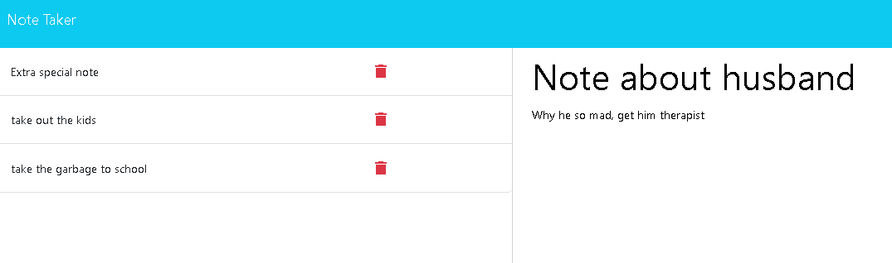

# noahjralph-note-taker

## Table of Contents

- [Description](#Description)
- [Installation](#Installation)
- [Usage](#Usage)
- [Test Instructions](#Test_Instructions)
- [License](#License)
- [Questions?](#Questions?)

## Description

My very own sadistic note taker. Made using the criteria from Module 11 of my edX Web Development bootcamp. I made it as compact as possible within my tight time limit I had.

## Installation

NA. Follow the deployed heroku link 

## Usage

Input your note into the fields, then click the floppy disk icon in the upper right to save your note. Hit the plus icon in the upper right to wipe the fields and make a new note.

## Demonstration

## License

This project is protected under the MIT License.

## Questions?

Reach out to me either on [GitHub](https://github.com/NoahJRalph) or by [Email](mailto:NoahJRalph@gmail.com).
